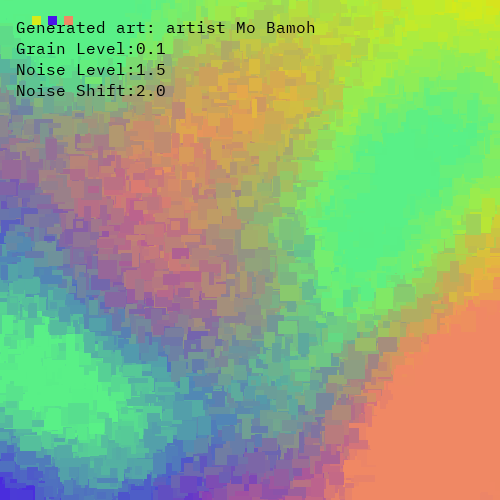
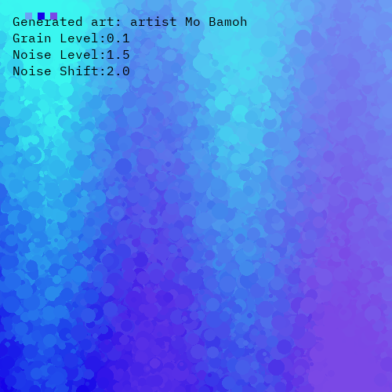
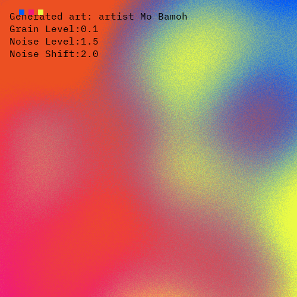
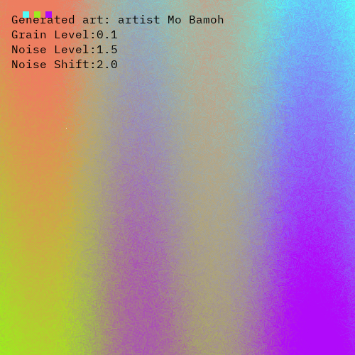

# Ombre Art Generator 🎨

Create stunning art with Python using the Ombre Art Generator. This versatile tool blends colors seamlessly to produce beautiful gradient-style artwork. Explore the world of digital artistry effortlessly with this open-source project.

# Demo

# Author
Mo bamoh